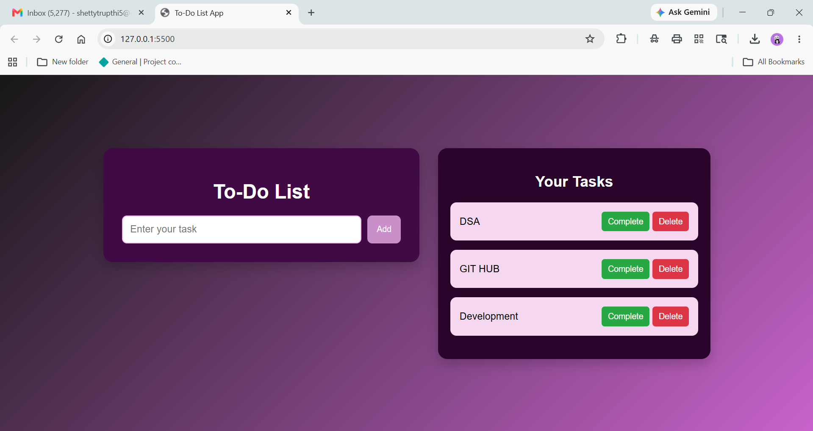
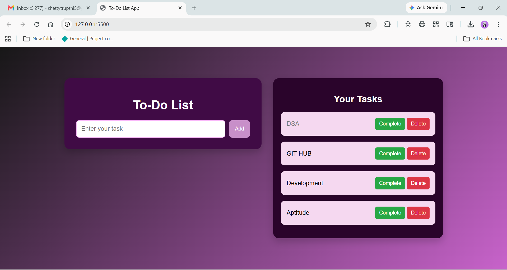

# ✅ To-Do List Web App

A simple and responsive To-Do List application built using **HTML5, CSS3, and Vanilla JavaScript**. This project allows users to efficiently manage their daily tasks by adding, completing, and deleting tasks in real time without page refreshes.

---

## 🚀 Features

- ➕ Add new tasks
- ✅ Mark tasks as completed
- 🗑️ Delete tasks instantly
- ⚡ Dynamic UI updates
- 📱 Responsive design
- 🎨 Clean and modern interface

---

## 📸 Screenshots

### Home Page



### Task Added



### Task Completed


### Task Deleted


---

## 🛠️ Tech Stack

### Frontend
- HTML5
- CSS3
- JavaScript (ES6)

### Tools
- Visual Studio Code
- Live Server
- Google Chrome

---

## 📂 Project Structure

```bash
todo-list-web-app/
│
├── index.html
├── style.css
├── script.js
├── README.md
├── P1.png
├── P3.png
├── MarkedComplete.png
└── TaskDeleted.png
```

---

## ⚙️ Getting Started

### Clone the Repository

```bash
git clone https://github.com/your-username/todo-list-web-app.git
```

### Navigate to the Project Folder

```bash
cd todo-list-web-app
```

### Run the Project

Open `index.html` in your browser or use the **Live Server** extension in VS Code.

---

## 🎯 Learning Outcomes

This project helped me gain practical experience in:

- DOM Manipulation
- Event Handling
- Dynamic Content Rendering
- JavaScript ES6 Features
- Responsive Web Design
- HTML & CSS Fundamentals

---

## 🔮 Future Enhancements

- 💾 Local Storage Support
- 🌙 Dark Mode
- 📅 Task Due Dates
- 🔍 Search & Filter Tasks
- 📊 Task Statistics Dashboard

---

## 👩‍💻 Author

**Trupthi Shetty**

Aspiring Software Developer passionate about Web Development and building user-friendly applications.

---

## ⭐ Show Your Support

If you found this project useful, consider giving it a **Star ⭐** on GitHub.

